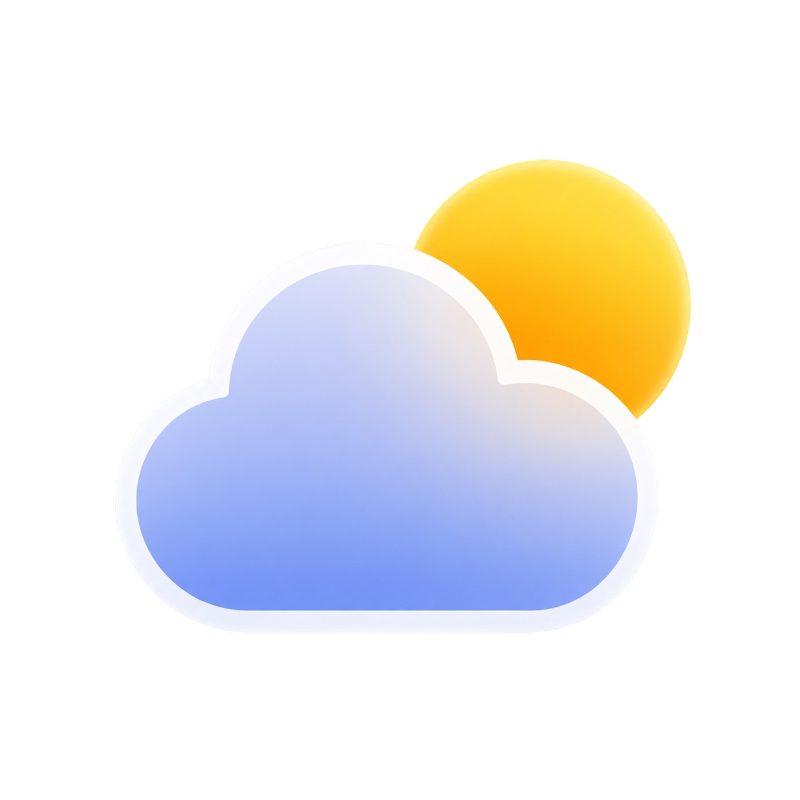
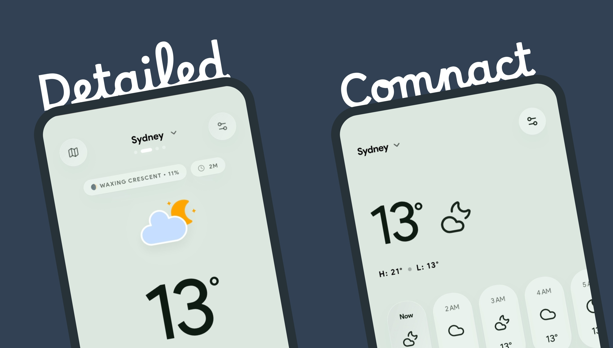
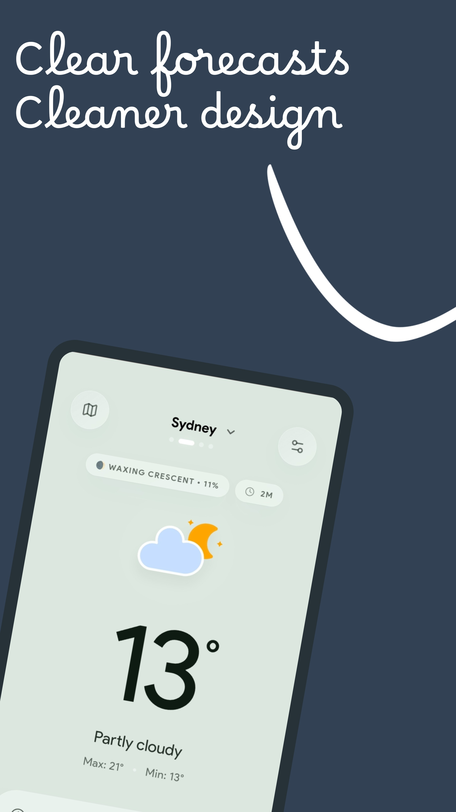
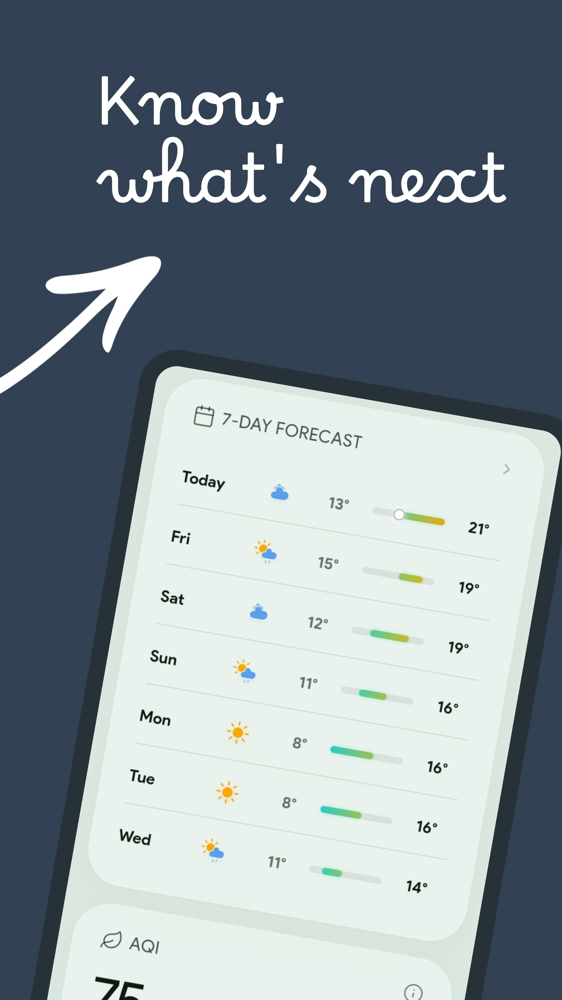
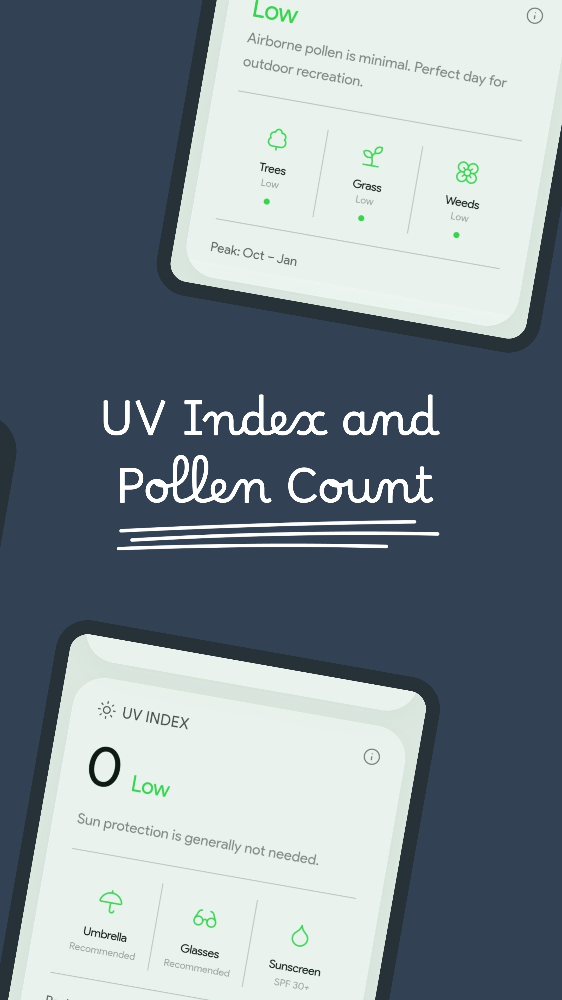
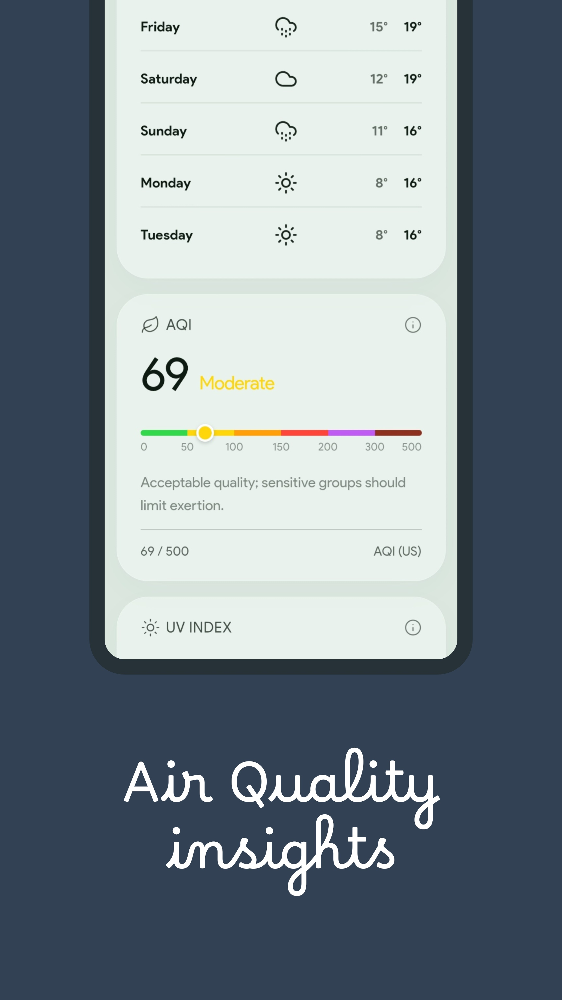
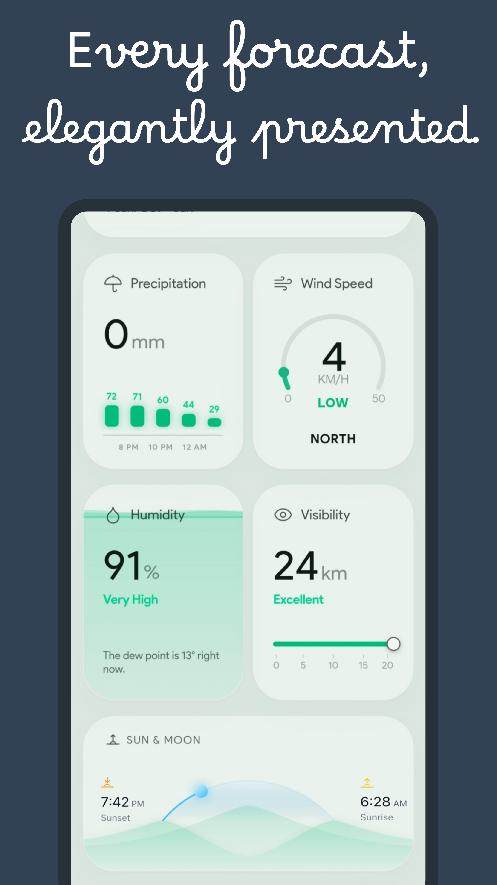
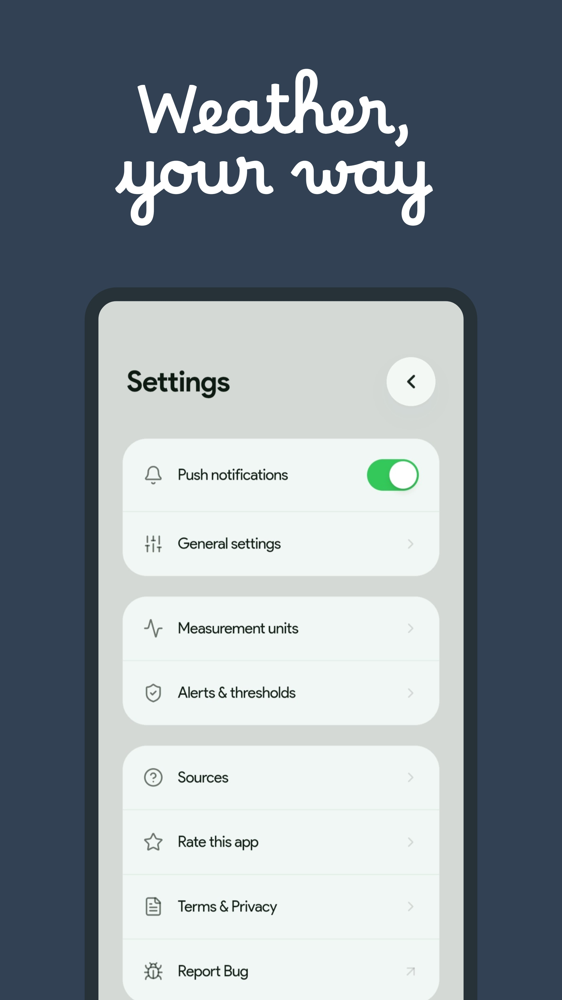

<p align="center">
  
</p>
<div align="center">
  <h3>Overcast</h3>
  <p>Overcast is a clean and not minimal weather app featuring real-time weather, hourly and daily forecasts, air quality, UV index, live radar and a polished UI.
</p>
</div>

<p align="center">
  
  
  
  
</p>

---

## ☀️ Features

-  **Real-time weather** : temperature, humidity, precipitation, visibility
- **Air Quality** : 6-level scale per CPCB standard.
- **Live Radar** : See real-time weather radar for precipitation, temperature, cloud cover and wind speed 
- **Live sunrise/sunset arc** : animated sun position synced to local timezone
- **Multi-city navigation** : swipe left/right to switch cities
- **Haptic feedback** : tactile response
- **Settings** : customizable thresholds for rain and snow alerts


---

## 📸 Showcase


<div align="centre">




&nbsp;

&nbsp;




&nbsp;

&nbsp;


</div>

## 🛠️ Built With

| Tool | Purpose |
|------|---------|
| HTML / CSS / Vanilla JS | Core app — no frameworks |
| Gemini 2.0 | AI-assisted development |
| Open-Meteo API | Weather + sunrise/sunset data |
| WAQI API | Air quality (Worldwide) |
| Chart.js | Forecast charts |
| Windy.com | Live Radar view |

---

## 📡 Data Sources

| Data | Source |
|------|--------|
| Weather | [Open-Meteo](https://open-meteo.com) — free, no key needed |
| Air Quality | [WAQI](https://waqi.info) — Worldwide AQI (CPCB standard) |
| Sunrise/Sunset | Open-Meteo Daily Forecast |
| Geolocation | Browser Geolocation API |

---

## 💨AQI Scale

| Range | Category | Color |
|-------|----------|-------|
| 0–50 | Good | 🟢 |
| 51–100 | Satisfactory | 🟡 |
| 101–200 | Moderate | 🟡 |
| 201–300 | Poor | 🟠 |
| 301–400 | Very Poor | 🔴 |
| 401–500 | Severe | 🟣 |

---


## 🌿 Pollen Forecast

**In Europe**, data comes straight from the Open-Meteo Air Quality API, which tracks real allergen concentrations by species.

**Everywhere else**, Overcast uses its own pollen estimation engine that combines seasonal botanical calendars with live weather data. It factors in your climate zone, local vegetation patterns, temperature, humidity, wind, rainfall, and even time of day to estimate how much pollen is actually in the air.

*Pollen forecasts outside Europe are modeled estimates derived from seasonal botanical patterns and real-time meteorological conditions. They are designed to provide meaningful allergy-risk guidance where direct pollen observations are not available, it can be inaccurate.*

## 🦸Getting Started

This is a single-file static web app. No build tools, no npm, no setup.

**Option 1 — Open directly:**
```
Just open index.html in any browser.
```

**Option 2 — Deploy to Vercel:**
1. Fork this repo
2. Go to [vercel.com](https://vercel.com)
3. Import the repo → leave all settings default → Deploy

---

## 📂Project Structure

```
vayu-weather/
│
└── index.html       # Entire app — HTML + CSS + JS in one file
└── README.md
```

---

## 🙇 Acknowledgements

- [Open-Meteo](https://open-meteo.com) — for providing f ree, open-source weather data
- [WAQI](https://waqi.info) — for global air quality data
- [OpenStreetMap](https://openstreetmap.org) — for interactive composite weather radar mapping.
- [amcharts](https://amcharts.com) – for providing beautiful weather icons.

---

## ⚖️ License

This project is licensed under the MIT License.

---

## Star History

<a href="https://www.star-history.com/?repos=aryannvaidya%2Fovercast&type=date&legend=top-left">
 <picture>
   <source media="(prefers-color-scheme: dark)" srcset="https://api.star-history.com/chart?repos=aryannvaidya/overcast&type=date&theme=dark&legend=top-left" />
   <source media="(prefers-color-scheme: light)" srcset="https://api.star-history.com/chart?repos=aryannvaidya/overcast&type=date&legend=top-left" />
   
 </picture>
</a>

